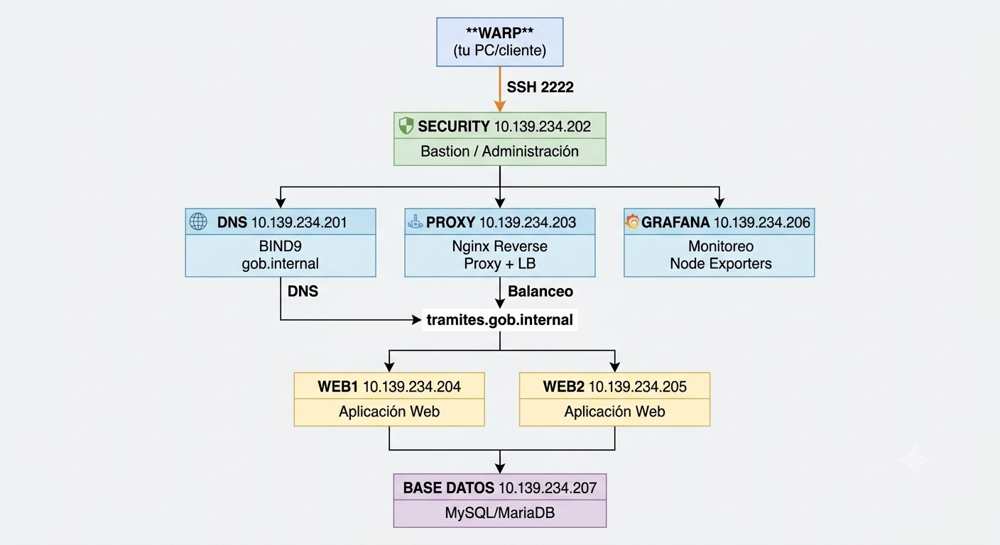

# Proyecto Final SIS313

## Infraestructura Segura para Plataforma de Trámites Gubernamentales

**Universidad San Francisco Xavier de Chuquisaca**
**Carrera:** Ingeniería de Sistemas
**Asignatura:** SIS313 - Infraestructura, Plataformas Tecnológicas y Redes
**Docente:** Ing. Marcelo Quispe Ortega
**Gestión:** 1/2026

| Integrante                    | Usuario | Responsabilidad Principal                                                                         |
| ----------------------------- | ---------------------- | ------------------------------------------------------------------------------------------------- |
| Anagua Muñoz Jhaqueline Celia | `@jcanaguam`               | Implementación de Proxy NGINX, WEB1 y WEB2, desarrollo de aplicación Node.js, pruebas de balanceo |
| Arancibia Mallón Luis Angel   | `__________`           | Integración de Base de Datos con MariaDB y monitoreo con Grafana                                  |
| Chumacero Steffany            | `__________`           | Configuración de Security, Hardening SSH, Firewall UFW y monitoreo                                |

---

# 1. Introducción

La transformación digital de instituciones gubernamentales requiere infraestructuras tecnológicas seguras, escalables y administrables que permitan ofrecer servicios de manera eficiente a los ciudadanos.

El presente proyecto tiene como finalidad diseñar e implementar una infraestructura virtual para una plataforma de trámites gubernamentales, integrando servicios de resolución DNS, balanceo de carga, monitoreo, administración centralizada y mecanismos básicos de seguridad.

La solución fue desarrollada utilizando máquinas virtuales Linux Ubuntu Server y diversas herramientas de código abierto ampliamente utilizadas en entornos empresariales.

---

# 2. Objetivo General

Diseñar e implementar una infraestructura virtual para una plataforma de trámites gubernamentales, incorporando servicios de resolución DNS, balanceo de carga, administración centralizada, monitoreo y mecanismos básicos de seguridad, garantizando disponibilidad, organización y control de acceso a los servicios.

---

# 3. Objetivos Específicos

* Implementar un servidor DNS interno para la resolución de nombres.
* Desplegar una aplicación web distribuida en múltiples servidores.
* Implementar un balanceador de carga utilizando NGINX.
* Configurar una base de datos centralizada para el almacenamiento de información.
* Implementar mecanismos básicos de seguridad mediante UFW y SSH Hardening.
* Centralizar la administración de la infraestructura.
* Implementar monitoreo mediante Grafana y Node Exporter.
* Automatizar tareas de auditoría mediante scripts Bash.

---

# 4. Justificación

En entornos empresariales y gubernamentales es fundamental contar con servicios accesibles, monitoreados y protegidos.

El uso exclusivo de direcciones IP dificulta la administración y escalabilidad de los servicios, mientras que la ausencia de balanceo de carga y monitoreo reduce la disponibilidad de la plataforma.

La solución propuesta permite:

* Centralizar la administración de la infraestructura.
* Acceder a los servicios mediante nombres DNS.
* Distribuir solicitudes entre múltiples servidores.
* Monitorear el estado de la plataforma.
* Aplicar controles básicos de seguridad.
* Facilitar futuras ampliaciones de la infraestructura.

---

# 5. Tecnologías Utilizadas

| Tecnología    | Función                     |
| ------------- | --------------------------- |
| Ubuntu Server | Sistema Operativo           |
| BIND9         | Servidor DNS                |
| NGINX         | Reverse Proxy y Balanceador |
| Node.js       | Plataforma de ejecución     |
| Express.js    | Framework Web               |
| MariaDB       | Base de Datos               |
| Grafana       | Monitoreo                   |
| Node Exporter | Recolección de métricas     |
| UFW           | Firewall                    |
| OpenSSH       | Administración remota       |
| Bash Scripts  | Automatización              |

---

# 6. Arquitectura de la Solución

## 6.1 Infraestructura Implementada

| Máquina Virtual | Rol                           | IP             |
| --------------- | ----------------------------- | -------------- |
| DNS             | Servidor DNS                  | 10.139.234.201 |
| Security        | Bastion Host y Administración | 10.139.234.202 |
| Proxy           | Reverse Proxy y Balanceador   | 10.139.234.203 |
| Web1            | Servidor de Aplicaciones      | 10.139.234.204 |
| Web2            | Servidor de Aplicaciones      | 10.139.234.205 |
| Grafana         | Monitoreo                     | 10.139.234.206 |
| Base            | MariaDB                       | 10.139.234.207 |

---

## 6.2 Dominios Configurados

* dns.gob.internal
* security.gob.internal
* proxy.gob.internal
* web1.gob.internal
* web2.gob.internal
* grafana.gob.internal
* base.gob.internal
* tramites.gob.internal

---

## 6.3 Diagrama Lógico




---

# 7. Componentes Implementados

## 7.1 DNS Interno

Se implementó BIND9 como servidor DNS interno para la resolución directa e inversa de nombres.

### Funcionalidades

* Resolución directa.
* Resolución inversa.
* Administración centralizada de nombres.
* Acceso mediante dominios internos.

---

## 7.2 Aplicación Web

Se desarrolló una aplicación web utilizando Node.js y Express.

### Funcionalidades

* Registro de solicitudes.
* Captura de datos ciudadanos.
* Inserción de registros en MariaDB.
* Acceso desde múltiples servidores.

### Campos Registrados

* Nombre
* CI
* Trámite
* Observación

---

## 7.3 Balanceador de Carga

NGINX fue configurado como Reverse Proxy.

### Funciones

* Distribución de solicitudes.
* Ocultamiento de servidores backend.
* Punto único de acceso.
* Mejora de disponibilidad.

### Backend Configurado

* Web1
* Web2

---

## 7.4 Base de Datos

MariaDB fue implementado como servidor centralizado.

### Base de Datos

db_tramites

### Tabla Principal

solicitudes

Campos:

* id
* nombre
* ci
* tramite
* observacion

---

## 7.5 Monitoreo

Grafana fue implementado para la visualización de métricas.

### Métricas Supervisadas

* CPU
* Memoria RAM
* Disco
* Red
* Disponibilidad de servicios

---
---

## 7.6 Comandos Principales Utilizados

## DNS

Verificar resolución:

     dig tramites.gob.internal

Resolución inversa:

     dig -x 10.139.234.203

---

## Proxy

Validar configuración:

     sudo nginx -t

Reiniciar servicio:

     sudo systemctl restart nginx

---

## WEB1 y WEB2

Ejecutar aplicación:

     node app.js

Verificar puerto:

     ss -tulpn | grep 3000

Probar aplicación:

     curl http://localhost:3000

---

## MariaDB

Ingresar:

     mysql -u root -p

Consultar registros:

     SELECT * FROM solicitudes;

---

## Firewall

Ver reglas:

     sudo ufw status verbose

---

## SSH

Verificar configuración:

     grep -E "^(Port|PermitRootLogin)" /etc/ssh/sshd_config

Estado:

     systemctl status ssh

---

# 8. Seguridad Implementada

## 8.1 Hardening SSH

Se aplicaron medidas básicas de endurecimiento:

* Cambio de puerto SSH a 2222.
* Restricción de intentos de autenticación.
* Deshabilitación de acceso root.
* Administración centralizada.

---

## 8.2 Firewall UFW

Se implementó control de acceso mediante UFW.

### Servicios Permitidos

* SSH
* HTTP
* HTTPS
* DNS
* Grafana
* MariaDB

### Política

* Denegar tráfico no autorizado.
* Permitir únicamente puertos requeridos.

---

## 8.3 Segmentación Lógica

Cada servicio fue ubicado en una máquina virtual independiente para reducir riesgos y mejorar la administración.

---

# 9. Automatización

Se desarrollaron scripts Bash para auditoría y verificación.

## Scripts Implementados

* check_ssh.sh
* check_firewall.sh
* check_users.sh
* audit_security.sh

### Funciones

* Validación de SSH.
* Verificación de Firewall.
* Auditoría de usuarios.
* Reportes básicos de seguridad.

---

# 10. Procedimiento de Implementación

1. Instalación de Ubuntu Server.
2. Configuración de IP estática.
3. Configuración de DNS BIND9.
4. Creación de zonas DNS.
5. Instalación de MariaDB.
6. Implementación de Node.js y Express.
7. Configuración de NGINX.
8. Configuración de Grafana.
9. Configuración de Node Exporter.
10. Implementación de UFW.
11. Configuración de SSH Hardening.
12. Implementación de scripts de auditoría.

---

# 11. Archivos de Configuración Utilizados

```text
/etc/bind/named.conf.local
/etc/bind/db.gob.internal
/etc/bind/db.234.139.10

/etc/nginx/sites-available/default

/etc/ssh/sshd_config

/opt/scripts/check_ssh.sh
/opt/scripts/check_firewall.sh
/opt/scripts/check_users.sh
/opt/scripts/audit_security.sh
```

---

# 12. Pruebas Realizadas

| Prueba                     | Resultado Esperado               | Resultado |
| -------------------------- | -------------------------------- | --------- |
| Resolución DNS directa     | Resolver dominios                | OK        |
| Resolución DNS inversa     | Resolver IP → Nombre             | OK        |
| Balanceo de carga          | Distribuir tráfico               | OK        |
| Inserción en Base de Datos | Registrar solicitudes            | OK        |
| Monitoreo Grafana          | Visualización de métricas        | OK        |
| Restricción mediante UFW   | Bloqueo de tráfico no autorizado | OK        |
| SSH puerto 2222            | Acceso remoto seguro             | OK        |

---

# 13. Resultados Obtenidos

La infraestructura implementada logró integrar servicios de red, seguridad, monitoreo y aplicaciones en una solución funcional.

Se consiguió:

* Centralización de servicios.
* Resolución DNS interna.
* Balanceo de carga operativo.
* Base de datos centralizada.
* Monitoreo en tiempo real.
* Aplicación de controles básicos de seguridad.
* Automatización de tareas administrativas.

---

# 14. Dificultades Encontradas

Durante el desarrollo del proyecto se identificaron los siguientes desafíos:

* Configuración de zonas DNS directas e inversas.
* Problemas iniciales de conectividad entre máquinas virtuales.
* Configuración de permisos remotos en MariaDB.
* Ajustes de reglas UFW.
* Integración entre NGINX y los servidores Node.js.
* Resolución de errores de acceso remoto mediante SSH.

---

# 15. Conclusiones

La implementación permitió aplicar conocimientos de infraestructura, administración de sistemas, redes y seguridad en un entorno práctico similar a escenarios reales.

Se logró construir una arquitectura distribuida capaz de ofrecer servicios web utilizando DNS, balanceo de carga, monitoreo y una base de datos centralizada.

Asimismo, se aplicaron mecanismos de protección mediante firewall, endurecimiento de SSH y automatización de auditorías, mejorando la seguridad y administración de la plataforma.

El proyecto demostró la importancia de la integración entre servicios de infraestructura para garantizar disponibilidad, control y escalabilidad.

---
